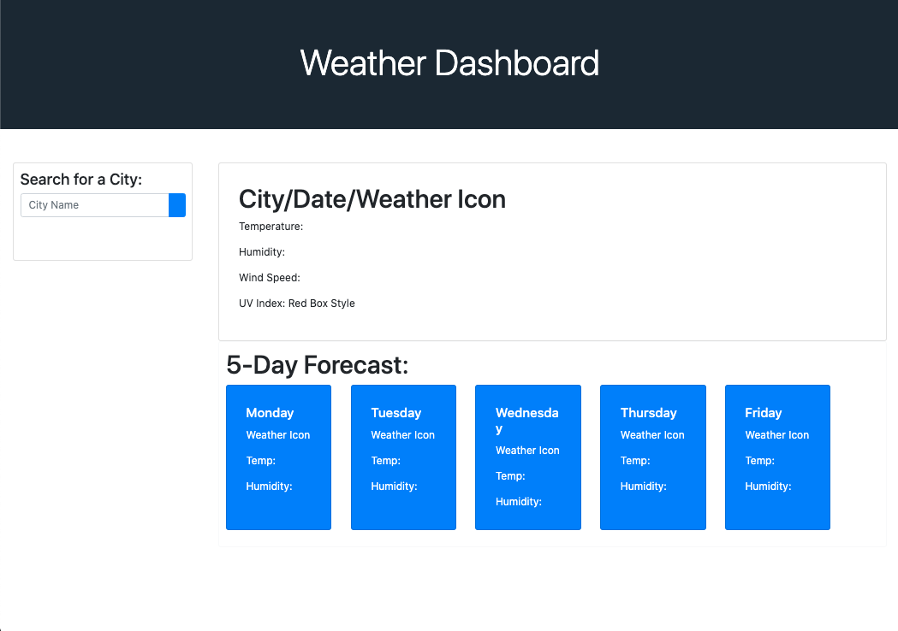

# Weather-Dashboard.github.io

Weather Dashboard presents you with the current forecast as well as a five day forecast by entering a city in the "Search for a City:" box. After choosing a city it will generate a "history list" underneath in case you would want to preview a previous city entered. 

Link: https://banda-adrian.github.io/Weather-Dashboard.github.io/.

<i>Not final product</i>
